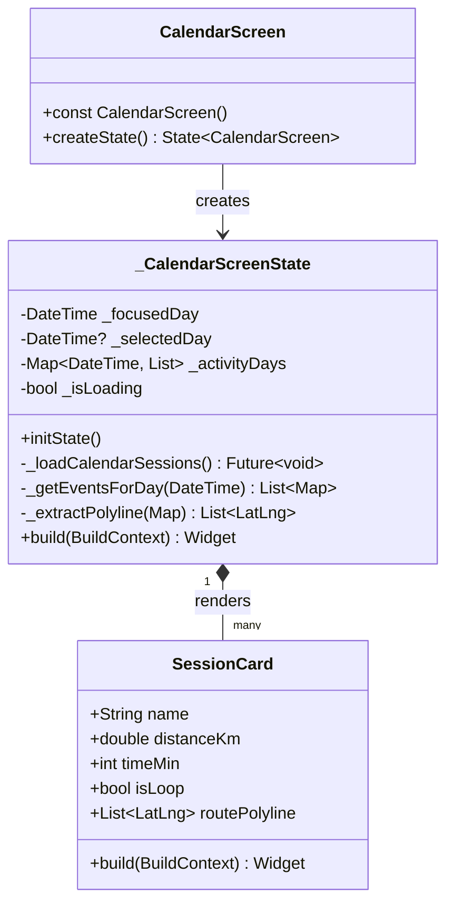

```mermaid
classDiagram
    class CalendarScreen {
        +const CalendarScreen()
        +createState() State~CalendarScreen~
    }

    class _CalendarScreenState {
        -DateTime _focusedDay
        -DateTime? _selectedDay
        -Map~DateTime, List~ _activityDays
        -bool _isLoading
        +initState()
        -_loadCalendarSessions() Future~void~
        -_getEventsForDay(DateTime) List~Map~
        -_extractPolyline(Map) List~LatLng~
        +build(BuildContext) Widget
    }

    class SessionCard {
        +String name
        +double distanceKm
        +int timeMin
        +bool isLoop
        +List~LatLng~ routePolyline
        +build(BuildContext) Widget
    }

    CalendarScreen --> _CalendarScreenState : creates
    _CalendarScreenState "1" *-- "many" SessionCard : renders
```
