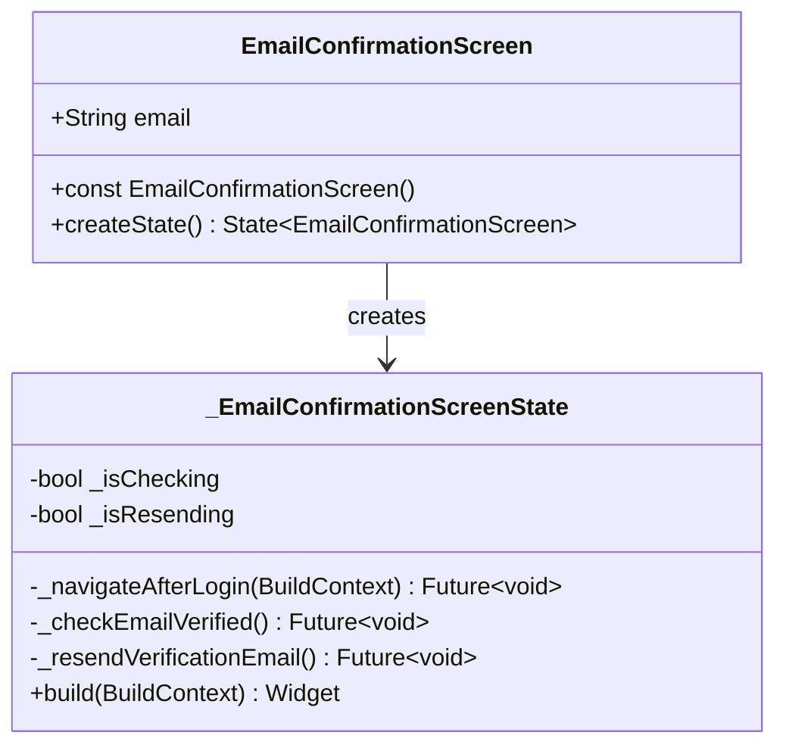

```mermaid
classDiagram
    class EmailConfirmationScreen {
        +String email
        +const EmailConfirmationScreen()
        +createState() State~EmailConfirmationScreen~
    }

    class _EmailConfirmationScreenState {
        -bool _isChecking
        -bool _isResending
        -_navigateAfterLogin(BuildContext) Future~void~
        -_checkEmailVerified() Future~void~
        -_resendVerificationEmail() Future~void~
        +build(BuildContext) Widget
    }

    EmailConfirmationScreen --> _EmailConfirmationScreenState : creates
```
