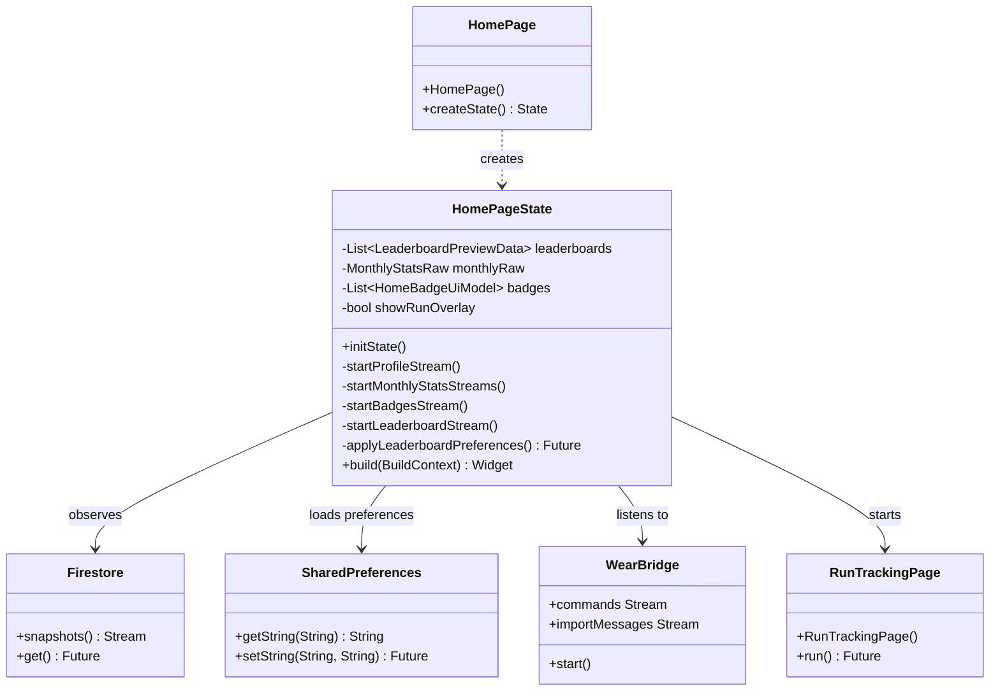

```mermaid
classDiagram
    class HomePage {
        +HomePage()
        +createState() State
    }

    class HomePageState {
        -List~LeaderboardPreviewData~ leaderboards
        -MonthlyStatsRaw monthlyRaw
        -List~HomeBadgeUiModel~ badges
        -bool showRunOverlay
        +initState()
        -startProfileStream()
        -startMonthlyStatsStreams()
        -startBadgesStream()
        -startLeaderboardStream()
        -applyLeaderboardPreferences() Future
        +build(BuildContext) Widget
    }

    class Firestore {
        +snapshots() Stream
        +get() Future
    }

    class SharedPreferences {
        +getString(String) String
        +setString(String, String) Future
    }

    class WearBridge {
        +start()
        +commands Stream
        +importMessages Stream
    }

    class RunTrackingPage {
        +RunTrackingPage()
        +run() Future
    }

    HomePage ..> HomePageState : creates
    HomePageState --> Firestore : observes
    HomePageState --> SharedPreferences : loads preferences
    HomePageState --> WearBridge : listens to
    HomePageState --> RunTrackingPage : starts
```
