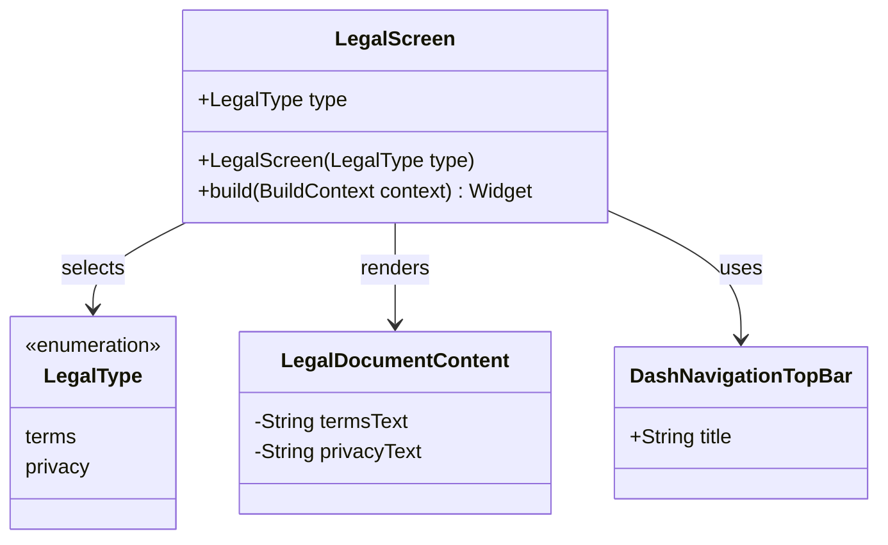

```mermaid
classDiagram

    class LegalType {
        <<enumeration>>
        terms
        privacy
    }

    class LegalScreen {
        +LegalType type
        +LegalScreen(LegalType type)
        +build(BuildContext context) Widget
    }

    class LegalDocumentContent {
        -String termsText
        -String privacyText
    }

    class DashNavigationTopBar {
        +String title
    }

    LegalScreen --> LegalType : selects
    LegalScreen --> LegalDocumentContent : renders
    LegalScreen --> DashNavigationTopBar : uses
```