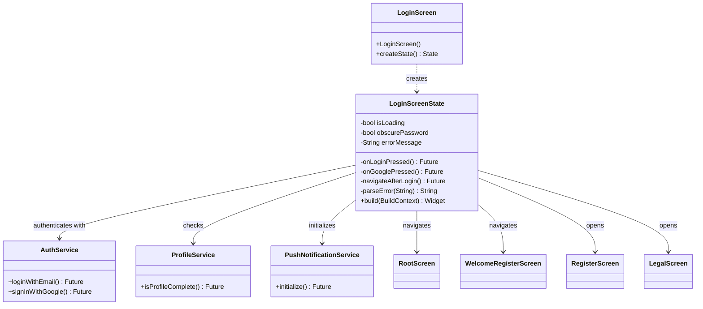

```mermaid
classDiagram
    class LoginScreen {
        +LoginScreen()
        +createState() State
    }

    class LoginScreenState {
        -bool isLoading
        -bool obscurePassword
        -String errorMessage
        -onLoginPressed() Future
        -onGooglePressed() Future
        -navigateAfterLogin() Future
        -parseError(String) String
        +build(BuildContext) Widget
    }

    class AuthService {
        +loginWithEmail() Future
        +signInWithGoogle() Future
    }

    class ProfileService {
        +isProfileComplete() Future
    }

    class PushNotificationService {
        +initialize() Future
    }

    class RootScreen
    class WelcomeRegisterScreen
    class RegisterScreen
    class LegalScreen

    LoginScreen ..> LoginScreenState : creates
    LoginScreenState --> AuthService : authenticates with
    LoginScreenState --> ProfileService : checks
    LoginScreenState --> PushNotificationService : initializes
    LoginScreenState --> RootScreen : navigates
    LoginScreenState --> WelcomeRegisterScreen : navigates
    LoginScreenState --> RegisterScreen : opens
    LoginScreenState --> LegalScreen : opens
```