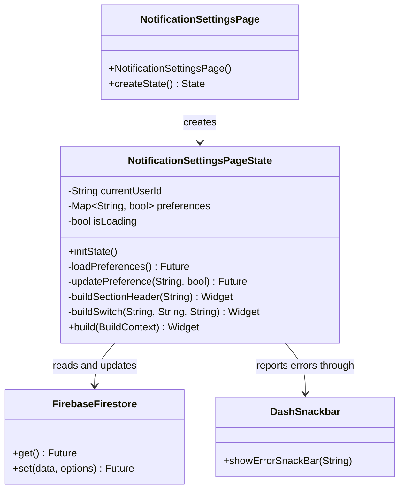

```mermaid
classDiagram
    class NotificationSettingsPage {
        +NotificationSettingsPage()
        +createState() State
    }

    class NotificationSettingsPageState {
        -String currentUserId
        -Map~String, bool~ preferences
        -bool isLoading
        +initState()
        -loadPreferences() Future
        -updatePreference(String, bool) Future
        -buildSectionHeader(String) Widget
        -buildSwitch(String, String, String) Widget
        +build(BuildContext) Widget
    }

    class FirebaseFirestore {
        +get() Future
        +set(data, options) Future
    }

    class DashSnackbar {
        +showErrorSnackBar(String)
    }

    NotificationSettingsPage ..> NotificationSettingsPageState : creates
    NotificationSettingsPageState --> FirebaseFirestore : reads and updates
    NotificationSettingsPageState --> DashSnackbar : reports errors through
```