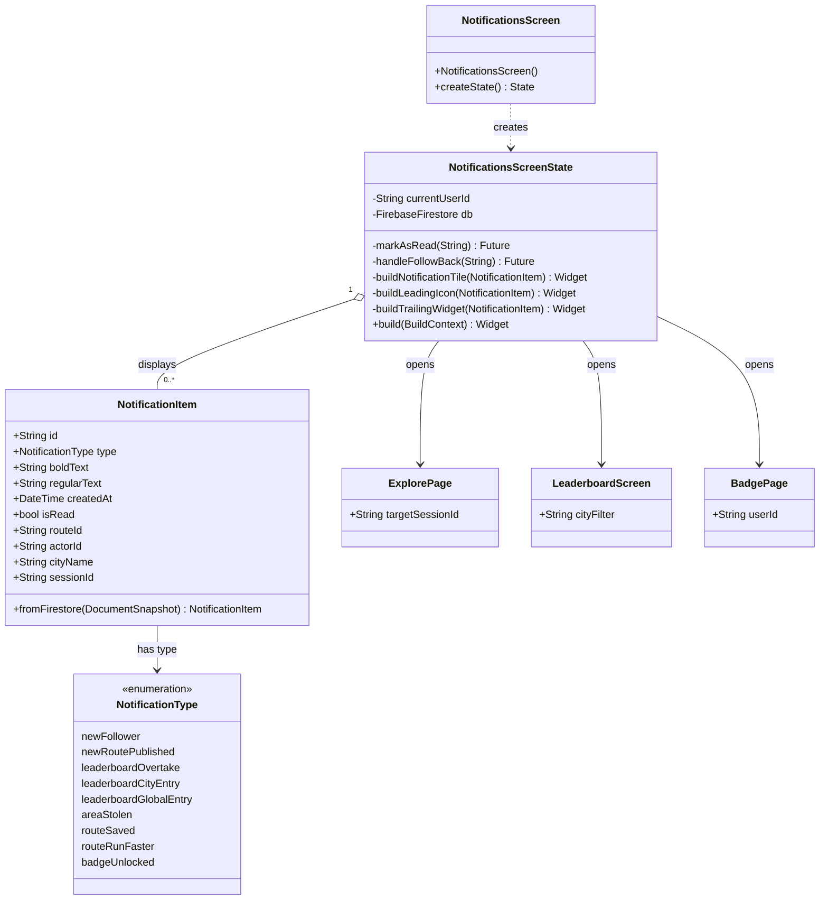

```mermaid
classDiagram
    class NotificationType {
        <<enumeration>>
        newFollower
        newRoutePublished
        leaderboardOvertake
        leaderboardCityEntry
        leaderboardGlobalEntry
        areaStolen
        routeSaved
        routeRunFaster
        badgeUnlocked
    }

    class NotificationItem {
        +String id
        +NotificationType type
        +String boldText
        +String regularText
        +DateTime createdAt
        +bool isRead
        +String routeId
        +String actorId
        +String cityName
        +String sessionId
        +fromFirestore(DocumentSnapshot) NotificationItem
    }

    class NotificationsScreen {
        +NotificationsScreen()
        +createState() State
    }

    class NotificationsScreenState {
        -String currentUserId
        -FirebaseFirestore db
        -markAsRead(String) Future
        -handleFollowBack(String) Future
        -buildNotificationTile(NotificationItem) Widget
        -buildLeadingIcon(NotificationItem) Widget
        -buildTrailingWidget(NotificationItem) Widget
        +build(BuildContext) Widget
    }

    class ExplorePage {
        +String targetSessionId
    }

    class LeaderboardScreen {
        +String cityFilter
    }

    class BadgePage {
        +String userId
    }

    NotificationsScreen ..> NotificationsScreenState : creates
    NotificationsScreenState "1" o-- "0..*" NotificationItem : displays
    NotificationItem --> NotificationType : has type
    NotificationsScreenState --> ExplorePage : opens
    NotificationsScreenState --> LeaderboardScreen : opens
    NotificationsScreenState --> BadgePage : opens
```