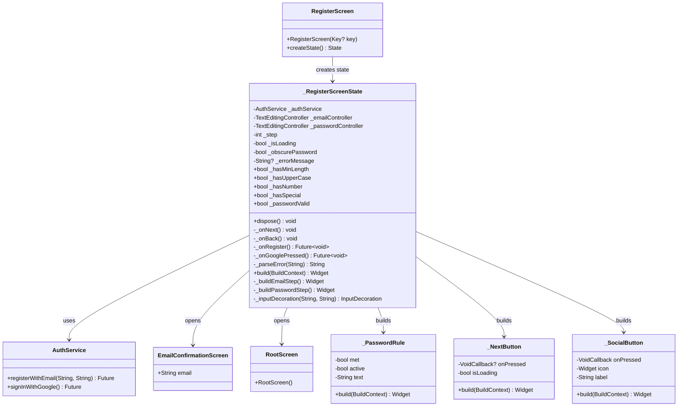

```mermaid
classDiagram
    class RegisterScreen {
        +RegisterScreen(Key? key)
        +createState() State
    }

    class _RegisterScreenState {
        -AuthService _authService
        -TextEditingController _emailController
        -TextEditingController _passwordController
        -int _step
        -bool _isLoading
        -bool _obscurePassword
        -String? _errorMessage
        +bool _hasMinLength
        +bool _hasUpperCase
        +bool _hasNumber
        +bool _hasSpecial
        +bool _passwordValid
        +dispose() void
        -_onNext() void
        -_onBack() void
        -_onRegister() Future~void~
        -_onGooglePressed() Future~void~
        -_parseError(String) String
        +build(BuildContext) Widget
        -_buildEmailStep() Widget
        -_buildPasswordStep() Widget
        -_inputDecoration(String, String) InputDecoration
    }

    class AuthService {
        +registerWithEmail(String, String) Future
        +signInWithGoogle() Future
    }

    class EmailConfirmationScreen {
        +String email
    }

    class RootScreen {
        +RootScreen()
    }

    class _PasswordRule {
        -bool met
        -bool active
        -String text
        +build(BuildContext) Widget
    }

    class _NextButton {
        -VoidCallback? onPressed
        -bool isLoading
        +build(BuildContext) Widget
    }

    class _SocialButton {
        -VoidCallback onPressed
        -Widget icon
        -String label
        +build(BuildContext) Widget
    }

    RegisterScreen --> _RegisterScreenState : creates state
    _RegisterScreenState --> AuthService : uses
    _RegisterScreenState --> EmailConfirmationScreen : opens
    _RegisterScreenState --> RootScreen : opens
    _RegisterScreenState --> _PasswordRule : builds
    _RegisterScreenState --> _NextButton : builds
    _RegisterScreenState --> _SocialButton : builds
```