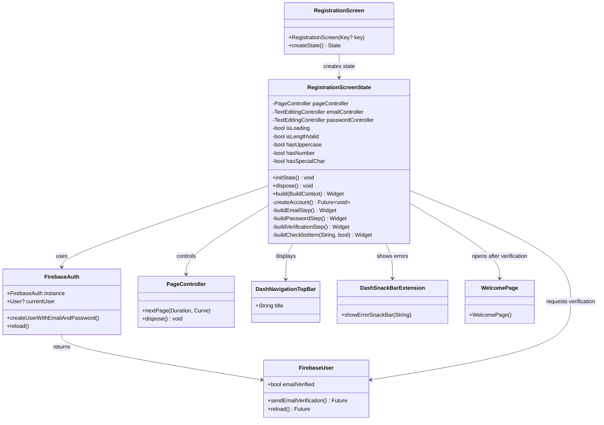

```mermaid
classDiagram
    class RegistrationScreen {
        +RegistrationScreen(Key? key)
        +createState() State
    }

    class RegistrationScreenState {
        -PageController pageController
        -TextEditingController emailController
        -TextEditingController passwordController
        -bool isLoading
        -bool isLengthValid
        -bool hasUppercase
        -bool hasNumber
        -bool hasSpecialChar
        +initState() void
        +dispose() void
        +build(BuildContext) Widget
        -createAccount() Future~void~
        -buildEmailStep() Widget
        -buildPasswordStep() Widget
        -buildVerificationStep() Widget
        -buildChecklistItem(String, bool) Widget
    }

    class FirebaseAuth {
        +FirebaseAuth instance
        +User? currentUser
        +createUserWithEmailAndPassword()
        +reload()
    }

    class FirebaseUser {
        +bool emailVerified
        +sendEmailVerification() Future
        +reload() Future
    }

    class PageController {
        +nextPage(Duration, Curve)
        +dispose() void
    }

    class DashNavigationTopBar {
        +String title
    }

    class DashSnackBarExtension {
        +showErrorSnackBar(String)
    }

    class WelcomePage {
        +WelcomePage()
    }

    RegistrationScreen --> RegistrationScreenState : creates state
    RegistrationScreenState --> PageController : controls
    RegistrationScreenState --> FirebaseAuth : uses
    FirebaseAuth --> FirebaseUser : returns
    RegistrationScreenState --> FirebaseUser : requests verification
    RegistrationScreenState --> DashNavigationTopBar : displays
    RegistrationScreenState --> DashSnackBarExtension : shows errors
    RegistrationScreenState --> WelcomePage : opens after verification
```