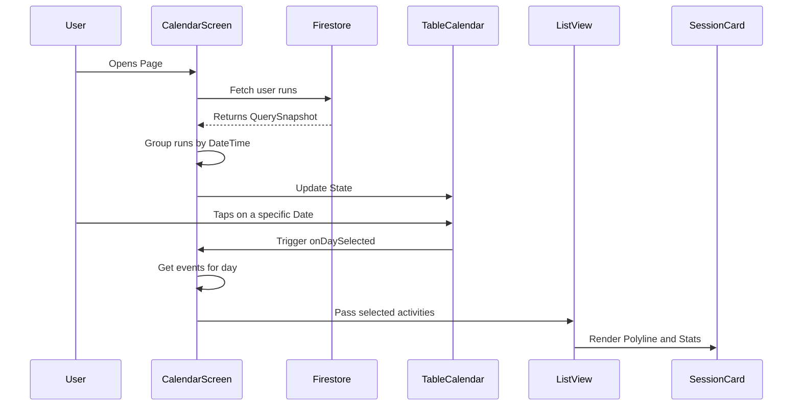

```mermaid
sequenceDiagram
    participant User
    participant CalendarScreen
    participant Firestore
    participant TableCalendar
    participant ListView

    User->>CalendarScreen: Opens Page
    CalendarScreen->>Firestore: Fetch user runs
    Firestore-->>CalendarScreen: Returns QuerySnapshot
    CalendarScreen->>CalendarScreen: Group runs by DateTime
    CalendarScreen->>TableCalendar: Update State
    
    User->>TableCalendar: Taps on a specific Date
    TableCalendar->>CalendarScreen: Trigger onDaySelected
    CalendarScreen->>CalendarScreen: Get events for day
    CalendarScreen->>ListView: Pass selected activities
    ListView->>SessionCard: Render Polyline and Stats
```
