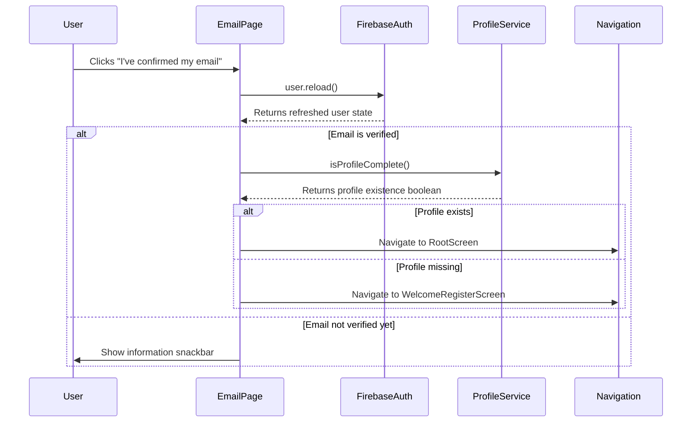

```mermaid
sequenceDiagram
    participant User
    participant EmailPage
    participant FirebaseAuth
    participant ProfileService
    participant Navigation

    User->>EmailPage: Clicks "I've confirmed my email"
    EmailPage->>FirebaseAuth: user.reload()
    FirebaseAuth-->>EmailPage: Returns refreshed user state
    alt Email is verified
        EmailPage->>ProfileService: isProfileComplete()
        ProfileService-->>EmailPage: Returns profile existence boolean
        alt Profile exists
            EmailPage->>Navigation: Navigate to RootScreen
        else Profile missing
            EmailPage->>Navigation: Navigate to WelcomeRegisterScreen
        end
    else Email not verified yet
        EmailPage->>User: Show information snackbar
    end
```
