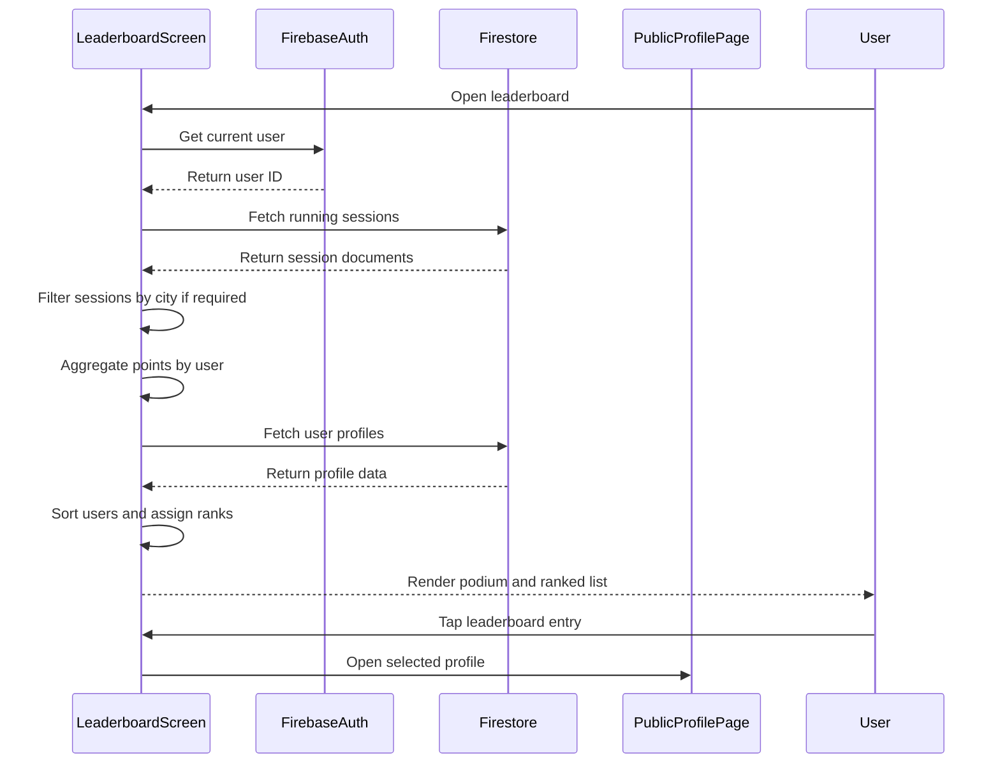

```mermaid
sequenceDiagram
    participant LeaderboardScreen
    participant FirebaseAuth
    participant Firestore
    participant PublicProfilePage

    User->>LeaderboardScreen: Open leaderboard
    LeaderboardScreen->>FirebaseAuth: Get current user
    FirebaseAuth-->>LeaderboardScreen: Return user ID
    LeaderboardScreen->>Firestore: Fetch running sessions
    Firestore-->>LeaderboardScreen: Return session documents
    LeaderboardScreen->>LeaderboardScreen: Filter sessions by city if required
    LeaderboardScreen->>LeaderboardScreen: Aggregate points by user
    LeaderboardScreen->>Firestore: Fetch user profiles
    Firestore-->>LeaderboardScreen: Return profile data
    LeaderboardScreen->>LeaderboardScreen: Sort users and assign ranks
    LeaderboardScreen-->>User: Render podium and ranked list

    User->>LeaderboardScreen: Tap leaderboard entry
    LeaderboardScreen->>PublicProfilePage: Open selected profile
```