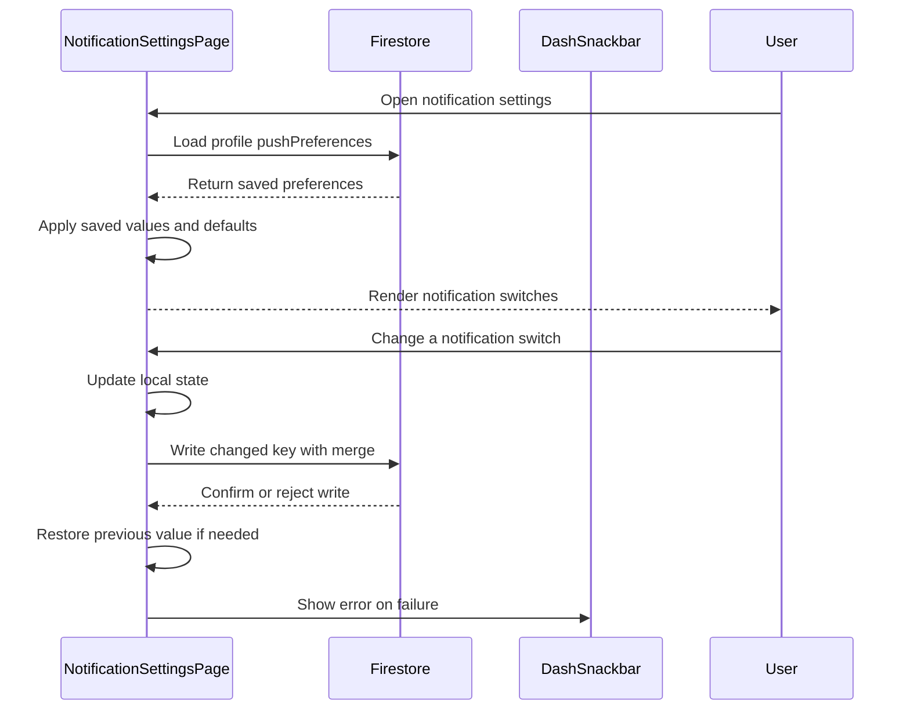

```mermaid
sequenceDiagram
    participant NotificationSettingsPage
    participant Firestore
    participant DashSnackbar

    User->>NotificationSettingsPage: Open notification settings
    NotificationSettingsPage->>Firestore: Load profile pushPreferences
    Firestore-->>NotificationSettingsPage: Return saved preferences
    NotificationSettingsPage->>NotificationSettingsPage: Apply saved values and defaults
    NotificationSettingsPage-->>User: Render notification switches

    User->>NotificationSettingsPage: Change a notification switch
    NotificationSettingsPage->>NotificationSettingsPage: Update local state
    NotificationSettingsPage->>Firestore: Write changed key with merge
    Firestore-->>NotificationSettingsPage: Confirm or reject write
    NotificationSettingsPage->>NotificationSettingsPage: Restore previous value if needed
    NotificationSettingsPage->>DashSnackbar: Show error on failure
```