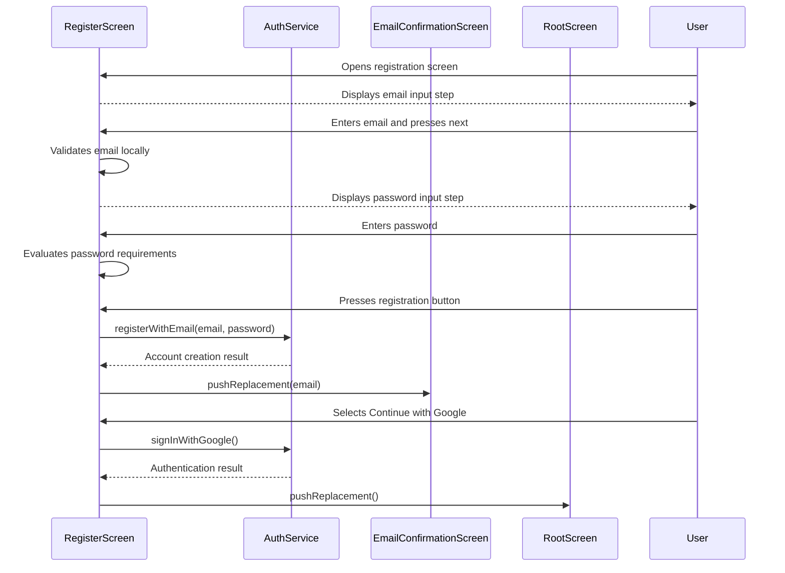

```mermaid
sequenceDiagram
    participant RegisterScreen
    participant AuthService
    participant EmailConfirmationScreen
    participant RootScreen

    User->>RegisterScreen: Opens registration screen
    RegisterScreen-->>User: Displays email input step
    User->>RegisterScreen: Enters email and presses next
    RegisterScreen->>RegisterScreen: Validates email locally
    RegisterScreen-->>User: Displays password input step
    User->>RegisterScreen: Enters password
    RegisterScreen->>RegisterScreen: Evaluates password requirements
    User->>RegisterScreen: Presses registration button
    RegisterScreen->>AuthService: registerWithEmail(email, password)
    AuthService-->>RegisterScreen: Account creation result
    RegisterScreen->>EmailConfirmationScreen: pushReplacement(email)

    User->>RegisterScreen: Selects Continue with Google
    RegisterScreen->>AuthService: signInWithGoogle()
    AuthService-->>RegisterScreen: Authentication result
    RegisterScreen->>RootScreen: pushReplacement()
```