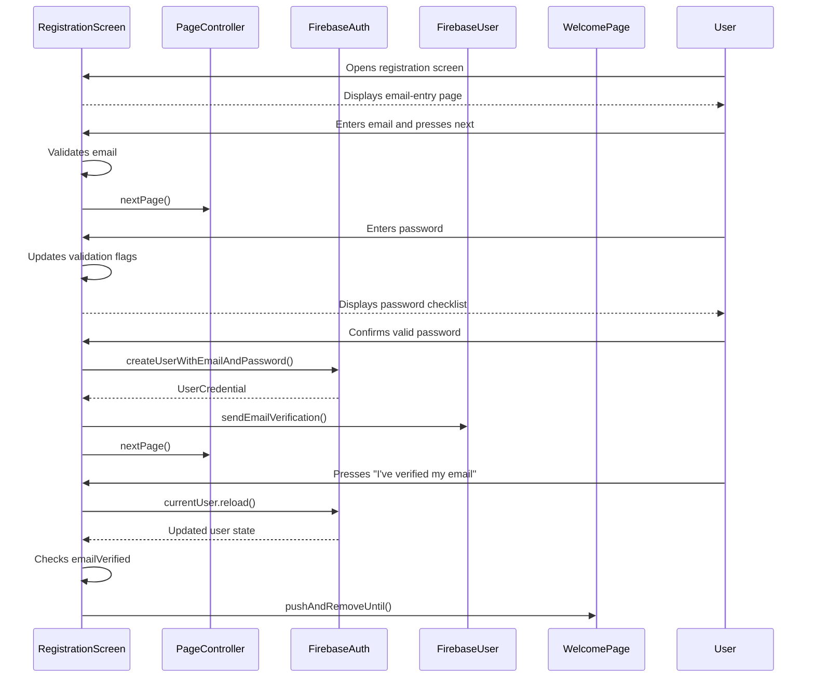

```mermaid
sequenceDiagram
    participant RegistrationScreen
    participant PageController
    participant FirebaseAuth
    participant FirebaseUser
    participant WelcomePage

    User->>RegistrationScreen: Opens registration screen
    RegistrationScreen-->>User: Displays email-entry page
    User->>RegistrationScreen: Enters email and presses next
    RegistrationScreen->>RegistrationScreen: Validates email
    RegistrationScreen->>PageController: nextPage()

    User->>RegistrationScreen: Enters password
    RegistrationScreen->>RegistrationScreen: Updates validation flags
    RegistrationScreen-->>User: Displays password checklist
    User->>RegistrationScreen: Confirms valid password

    RegistrationScreen->>FirebaseAuth: createUserWithEmailAndPassword()
    FirebaseAuth-->>RegistrationScreen: UserCredential
    RegistrationScreen->>FirebaseUser: sendEmailVerification()
    RegistrationScreen->>PageController: nextPage()

    User->>RegistrationScreen: Presses "I've verified my email"
    RegistrationScreen->>FirebaseAuth: currentUser.reload()
    FirebaseAuth-->>RegistrationScreen: Updated user state
    RegistrationScreen->>RegistrationScreen: Checks emailVerified
    RegistrationScreen->>WelcomePage: pushAndRemoveUntil()
```